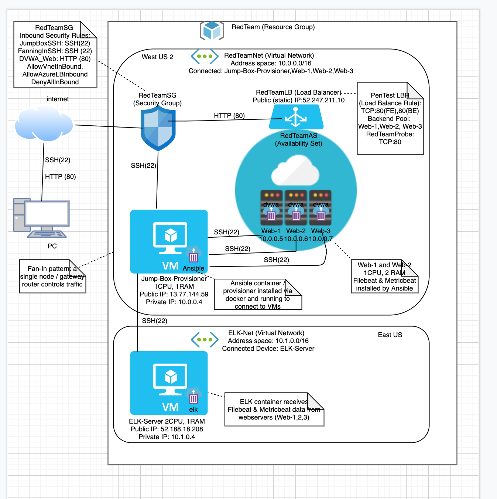

## Automated ELK Stack Deployment

The files in this repository were used to configure the network depicted below.

These files have been tested and used to generate a live ELK deployment on Azure. They can be used to either recreate the entire deployment pictured above. Alternatively, select portions of the _filebeat-playbook____ file may be used to install only certain pieces of it, such as Filebeat.

  - _TODO: Enter the playbook file._
---
- name: Installing and Launch Filebeat
  hosts: webservers
  become: yes
  tasks:
  - name: Download filebeat .deb file
    command: curl -L -O https://artifacts.elastic.co/downloads/beats/filebeat/filebeat-7.4.0-amd64.deb

  - name: Install filebeat .deb
    command: dpkg -i filebeat-7.4.0-amd64.deb

  - name: Drop in filebeat.yml
    copy:
      src: /etc/ansible/files/filebeat-config.yml
      dest: /etc/filebeat/filebeat.yml
      mode: '0644'  # added by Ethan

  - name: Enable and Configure System Module
    command: filebeat modules enable system

  - name: Setup filebeat
    command: filebeat setup

  - name: Start filebeat service
    command: service filebeat start  

This document contains the following details:
- Description of the Topology
- Access Policies
- ELK Configuration
  - Beats in Use
  - Machines Being Monitored
- How to Use the Ansible Build

### Description of the Topology

The main purpose of this network is to expose a load-balanced and monitored instance of DVWA, the D*mn Vulnerable Web Application.

Load balancing ensures that the application will be highly available, in addition to restricting _unauthorized access_ to the network.
- _TODO: What aspect of security do load balancers protect?
Availability

What is the advantage of a jump box? It only allows access to the virtual network from an entity/user with public SSH key.  It also protects the VMs on the virtual network by ensuring that they can't be accessed. 

Integrating an ELK server allows users to easily monitor the vulnerable VMs for changes to the _files____ and system _metrics____.
- _TODO: What does Filebeat watch for?_file system
- _TODO: What does Metricbeat record?_machine metrics

The configuration details of each machine may be found below.
_Note: Use the [Markdown Table Generator](http://www.tablesgenerator.com/markdown_tables) to add/remove values from the table_.

| Name     | Function    | IP Address | Operating System |
|----------|----------   |------------|------------------|
| Jump Box | Gateway     | 10.0.0.4   | Linux            |
| Web-1    | DVWA server | 10.0.0.5   | Linux            |
| Web-2    | DVWA server | 10.0.0.6   | Linux            |
| Web-3    | DVWA server | 10.0.0.7   | Linux            |
| ELK Server | network traffic monitor | 10.1.0.4 | Linux  |

### Access Policies

The machines on the internal network are not exposed to the public Internet. 

Only the _Jump-Box-Provisioner_ machine can accept connections from the Internet. Access to this machine is only allowed from the following IP addresses:
- _TODO: 13.77.144.59

Machines within the network can only be accessed by _Jump-Box-Provisioner__.
- _TODO: Which machine did you allow to access your ELK VM? any VM within network 
What was its IP address?_52.188.18.208

A summary of the access policies in place can be found in the table below.

| Name       | Publicly Accessible | Allowed IP Addresses |
|----------  |---------------------|----------------------|
| Jump Box   | Yes       | any IP address with SSH key, 10.0.0.5, 10.0.0.6, 10.0.0.7, 10.1.0.4 |
| Web-1/2/3  | No        | 10.0.0.4, 10.0.0.5, 10.0.0.6, 10.0.0.7, 10.1.0.4                    |
| ELK Server | No        | 10.0.0.4, 10.0.0.5, 10.0.0.6, 10.0.0.7                              |

### Elk Configuration

Ansible was used to automate configuration of the ELK machine. No configuration was performed manually, which is advantageous because...
- _TODO: What is the main advantage of automating configuration with Ansible?_
It enables to quickly remove and relaunch the server if it is ever compromised. 

The playbook implements the following tasks:
- _TODO: In 3-5 bullets, explain the steps of the ELK installation play. E.g., install Docker; download image; etc._
- Install docker.io
- Install pip3 and Docker python module
- Increase virtual memory
- Download and launch a docker ELK container, image (sebp/elk), ports (5601, 9200, 5044)

The following screenshot displays the result of running `docker ps` after successfully configuring the ELK instance.

### Target Machines & Beats
This ELK server is configured to monitor the following machines:
- _TODO: List the IP addresses of the machines you are monitoring_
10.0.0.5 (Web-1), 10.0.0.6 (Web-2), 10.0.0.7 (Web-3)

We have installed the following Beats on these machines:
- _TODO: Specify which Beats you successfully installed_
Filebeat and Metricbeat on webservers

These Beats allow us to collect the following information from each machine:
- _TODO: In 1-2 sentences, explain what kind of data each beat collects, and provide 1 example of what you expect to see. E.g., `Winlogbeat` collects Windows logs, which we use to track user logon events, etc._

Filebeat collects data about the file system such as /etc/passwd.
Metricbeat collects machine metrics such as CPU usage, Uptime.

### Using the Playbook
In order to use the playbook, you will need to have an Ansible control node already configured. Assuming you have such a control node provisioned: 

SSH into the control node and follow the steps below:
- Copy the _public SSH key____ file to _VM____.
- Update the _host__ file to include [webservers] IP address, and ansible.cfg (config file) to include remote_user...
- Run the playbook, and navigate to _DVWA___ to check that the installation worked as expected.

_TODO: Answer the following questions to fill in the blanks:_
- _Which file is the playbook? YAML file Where do you copy it?_
- _Which file do you update to make Ansible run the playbook on a specific machine? hosts How do I specify which machine to install the ELK server on versus which to install Filebeat on?_In intall-elk.yml, list hosts: elkservers. 
- _Which URL do you navigate to in order to check that the ELK server is running?
http://[your.VM.IP]:5601/app/kibana

_As a **Bonus**, provide the specific commands the user will need to run to download the playbook, update the files, etc._